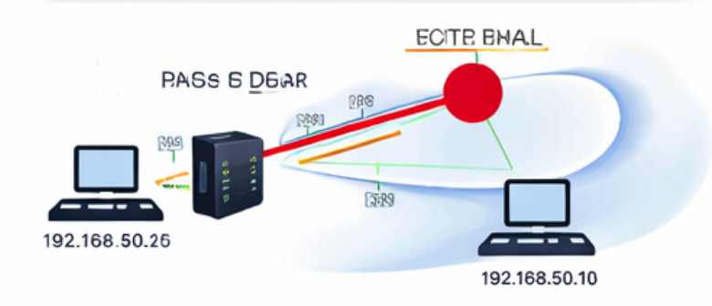
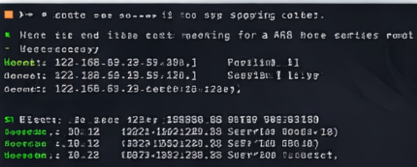
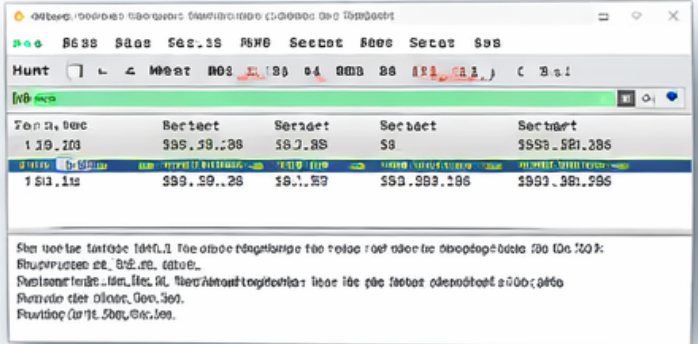
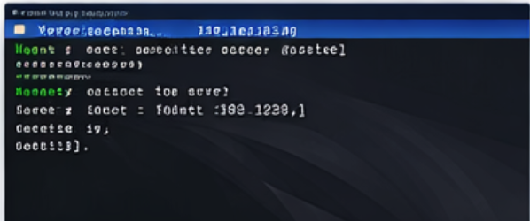
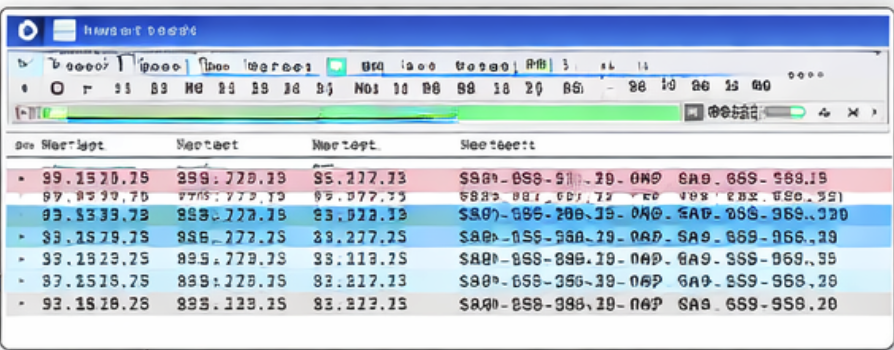
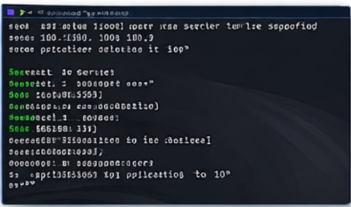
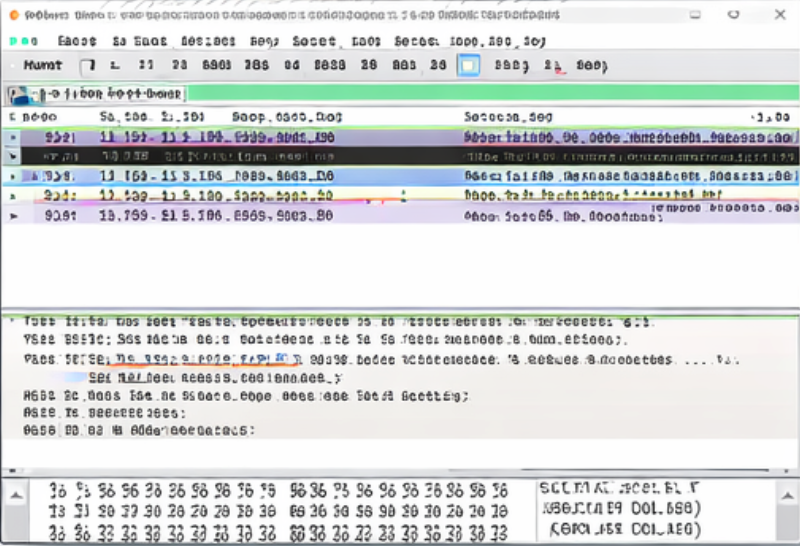
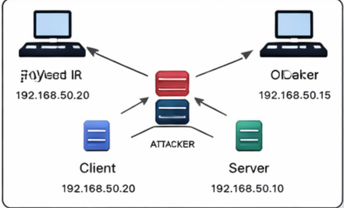
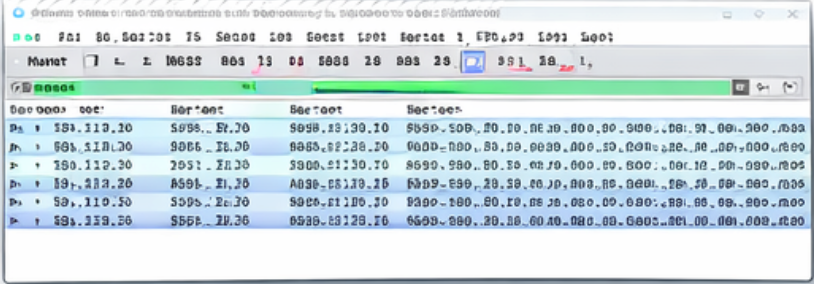

# SECURY-NETWORK-5
Praktikum Modul 5 Keamanan Jaringan
# SECURY-NETWORK-5
## Praktikum Modul 5 – Keamanan Jaringan  
**Topik:** Sniffing, Spoofing, Session Hijacking, dan DoS

---

## 👤 Identitas Mahasiswa
- **Nama** : MUH AL HAIKAL  
- **NIM**  : 105841118623  
- **Program Studi** : Teknik Informatika  
- **Universitas** : Universitas Muhammadiyah Makassar  

---

## 🎯 Tujuan Praktikum
1. Memahami konsep sniffing dan spoofing pada jaringan komputer  
2. Menganalisis serangan Man-In-The-Middle (MITM)  
3. Mengamati proses session hijacking pada protokol tidak terenkripsi  
4. Menguji serangan Denial of Service (DoS)  
5. Mempelajari metode pengamanan jaringan  

---

## 📚 Dasar Teori Singkat

### Sniffing
Sniffing adalah teknik penyadapan paket data yang melewati jaringan. Serangan ini efektif pada protokol tanpa enkripsi seperti Telnet.

### Spoofing
Spoofing adalah pemalsuan identitas jaringan, seperti ARP spoofing dan IP spoofing, untuk mengalihkan lalu lintas data.

### Session Hijacking
Session hijacking adalah pengambilalihan sesi komunikasi aktif antara client dan server oleh attacker.

### Denial of Service (DoS)
DoS bertujuan melumpuhkan layanan jaringan dengan membanjiri target menggunakan trafik berlebih.

---

## 🧪 Topologi Jaringan Praktikum

**Keterangan:**
- Client : 192.168.50.20  
- Server : 192.168.50.10  
- Attacker : 192.168.50.15  

---

## 🔐 Percobaan 1 – ARP Spoofing (MITM)

**Penjelasan:**  
Attacker melakukan ARP poisoning sehingga lalu lintas antara client dan server dialihkan melalui attacker.

---

## 📋 Percobaan 2 – ARP Table Setelah Poisoning

**Penjelasan:**  
Tabel ARP target berubah dan menunjukkan MAC address attacker sebagai pemilik IP server.

---

## 🕵️ Percobaan 3 – Sniffing Telnet (Wireshark)

**Penjelasan:**  
Data Telnet dapat dibaca secara plaintext menggunakan Wireshark.

---

## 🎯 Percobaan 4 – Session Hijacking

**Penjelasan:**  
Attacker berhasil mengambil alih sesi komunikasi Telnet yang sedang berlangsung.

---

## 🔐 Percobaan 5 – Perbandingan Telnet dan SSH

**Penjelasan:**  
Telnet mengirimkan kredensial tanpa enkripsi sehingga mudah disadap.

---

## 💥 Percobaan 6 – Serangan DoS (SYN Flood)

**Penjelasan:**  
Attacker membanjiri server dengan permintaan SYN untuk menghabiskan resource.

---

## 📊 Capture Wireshark Serangan DoS

**Penjelasan:**  
Terlihat lonjakan trafik abnormal pada Wireshark selama serangan berlangsung.

---

## ☠️ Percobaan 7 – Ping of Death

**Penjelasan:**  
Pengiriman paket ICMP berukuran besar menyebabkan gangguan pada target.

---

## 🚪 Percobaan 8 – Backdoor Menggunakan Netcat

**Penjelasan:**  
Attacker berhasil membuka shell server melalui backdoor Netcat.

---

## 📈 Analisis Hasil
- Sniffing efektif pada protokol tidak terenkripsi  
- ARP spoofing memungkinkan MITM  
- Telnet sangat tidak aman  
- SSH lebih aman karena enkripsi  
- DoS dapat melumpuhkan layanan  
- Backdoor memberikan akses ilegal ke sistem  

---

## 🛡️ Metode Penanggulangan
- Menggunakan protokol terenkripsi (SSH, HTTPS)  
- Static ARP table  
- Firewall dan iptables  
- IDS/IPS  
- Segmentasi jaringan  

---

## 🧾 Kesimpulan
Praktikum ini menunjukkan bahwa kelemahan konfigurasi dan penggunaan protokol tidak aman dapat dimanfaatkan attacker untuk melakukan sniffing, spoofing, session hijacking, dan DoS. Pengamanan jaringan sangat penting untuk menjaga kerahasiaan dan ketersediaan layanan.

---

## ⚠️ Catatan Akademik
Repository ini dibuat **hanya untuk keperluan pembelajaran dan praktikum**, bukan untuk aktivitas ilegal.

---

## 📌 Lisensi
Pendidikan dan non-komersial.
